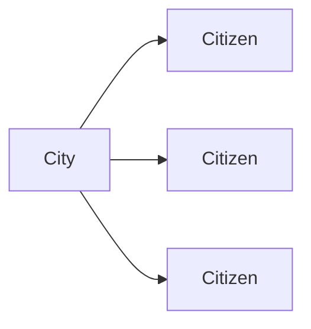

# Tutorial 5 進階 models  
  
#### [完整說明請參考官方文件](https://docs.djangoproject.com/en/2.0/topics/db/models/)  
下面將會介紹`models`的  
Fields  
Options  
Relationships  
class Meta  
def \_\_str\_\_(self):  
  
  
  
## Fields  
每個`models`的`Field`分別對應到不同的資料庫欄位型態  
這裡會介紹以下幾種`Fields`，沒介紹的應該用不太到，請自行參考官方文件  
文字類型:`CharField`、`TextField`、`EmailField`  
整數類型:`IntegerField`、`BigIntegerField`、`PositiveIntegerField`、`PositiveSmallIntegerField`  
小數類型:`FloatField`、`FloatField`  
日期類型:`DateField`、`DateTimeField`  
布林類型:`BooleanField`、`NullBooleanField`  
  
  
#### 文字類型  
1. ##### CharField
`name = models.CharField(max_length=255)`  
字元字串欄位，`max_length`是必要的參數，上限為255  
  
2. ##### TextField
`description = models.TextField()`  
為一個文字框輸入欄位，若`CharField`長度超過255則使用此類型，可以加上`max_length`參數，但只作用在`client`端，`model`及`database`不起作用。  
  
3. ##### EmailField
`email = models.EmailField()`  
電子郵件欄位，若不給參數，預設參數為`max_length=254`  
  
#### 整數類型  
1. ##### IntegerField
`num = models.IntegerField()`  
整數類型欄位，值的範圍為`-2147483648`至`2147483647`  
  
2. ##### BigIntegerField
`num = models.BigIntegerField()`
64位元整數欄位，值的範圍為`-9223372036854775808`至`9223372036854775807`  
  
3. ##### PositiveIntegerField
`num = models.PositiveIntegerField()`  
正整數欄位，值的範圍為`0`至`2147483647`  
  
4. ##### PositiveSmallIntegerField
`num = models.PositiveSmallIntegerField()`  
小正整數欄位，值的範圍為`0`至`32767`  
  
  
#### 小數類型  
1. ##### FloatField
`num = models.FloatField()`  
浮點數欄位，因為精度問題，在數字計算上可能會有誤差。  
  
2. ##### DecimalField
`models.DecimalField(max_digits=10, decimal_places=3)`  
十進制欄位，通常使用在計算不可有誤差的地方，如:金額。  
需要`max_digits`及`decimal_places`這2個參數。  
`max_digits`表示此欄位允許的最大位數  
`decimal_places`表示使用幾個位數顯示小數部分  
`12345.67`有7位數，小數部分2位數  
`models.DecimalField(max_digits=7, decimal_places=2)`  
  
  
#### 日期類型  
1. ##### DateField
`date = models.DateField()`  
使用`python`的`datetime.date`為實例來表示`年-月-日`  
  
2. ##### DateTimeField
`time = models.DateTimeField()`  
使用`python`的`datetime.datetime`為實例來表示`年-月-日 時:分:秒`  
2個日期類型都有`auto_now`及`auto_now_add`2個可選參數，預設皆為`False`。  
  
若設定參數`auto_now=True`，日期會在資料被新增時自動加入當下的日期時間(新增時指定日期時間無效)，新增後只有在每次使用`object.save()`才會更新日期時間，常常使用在最後編輯的時間。  
  
若設定參數`auto_now_add=True`，日期會在資料被新增時自動加入當下的日期時間(新增時指定日期時間無效)，新增後可隨意修改日期時間，通常用在記錄資料建立的時間。  
  
  
#### 布林類型  
1. ##### BooleanField
`check = models.BooleanField()`  
只有`true`或`false`的資料型態，預設為`false`，如果需要接受`null`，改用`NullBooleanField`  
  
2. ##### NullBooleanField
`check = models.NullBooleanField()`  
接受`true`、`false`、`null`3種資料型態，預設為`null`，使用此類型，會自動設定`null=True`參數。  
  
  
  
## Options  
上面介紹的每個`Field`，除了指定要給的參數為，還有一些參數可供選擇，這裡會介紹以下參數  
`null`  
`blank`  
`choices`  
`default`  
`help_text`  
`primary_key`  
`unique`  
`verbose_name`  
  
  
##### null  
`name = models.CharField(max_length=10, null=False)`  
若不指定此參數，預設值為`null=False`，若設定成`null=True`，此欄位可允許存入`null`值。  
  
  
##### blank  
`name = models.CharField(max_length=10, blank=False)`  
若不指定此參數，預設值為`blank=False`，若設定成`blank=True`，此欄位可允許存入`空白`值。  
  
  
##### choices  
test  
  
  
##### default  
`name = models.CharField(max_length=10, default='value')`  
設定`default`參數，可指定此欄位預設值為何  
`default='低否'`表示此Char欄位預設值為`低否`  
  
  
##### help\_text  
test  
  
  
##### primary\_key  
`id = models.PositiveIntegerField(primary_key=False)`  
`primary_key`參數指定此欄位為`table`的主鍵，通常不需額外指定此欄位，`Django`會自動新增一個`AutoField`型態的`id`欄位給`table`當主鍵。  

`name = models.CHarField(max_length=10, primary_key=True)`  
如果自行指定其他欄位為`primary_key`，此欄位會自動增加`null=False`及`unique=True`這2個參數。  
  
一張`table`只允許一個`primary_key`  
  
  
##### unique  
`phone = models.PositiveIntegerField(unique=False)`  
`unique`參數預設為`False`，如果設定`unique=True`，表示此欄位所存放的值不可與其他欄位重複。  
  
除了`OneToOneField`及`ManyToManyField`之外，其他`Field`皆可使用此參數。
  
  
##### verbose\_name  
此參數可以給予欄位一個暱稱來顯示，若不指定此參數，`Django`會將欄位名稱的字首英文字母大寫，並將底線轉為空格。  
  
下面例子會以`First name`來顯示  
`first_name = models.CharField(max_length=10)`  
  
下面例子會以`Lastname`來顯示  
`last_name = models.CHarField(max_length=10, verbose_name='lastname')`  
  
下面例子會以`NICK_NAME`來顯示，使用此方法，必將顯示名稱放在最前端，才可不輸入`verbose_name`  
`nick_name = models.CharField('NICK_NAME', max_length=10)`  
  
  
  
## Relationships  
`Django`的`models`也支援了關聯式資料庫的`ForeignKey`、`ManyToOne`、`OneToOne`、`ManyTOMany`  
  
  
#### ForeignKey and ManyToOne  
`relation = models.ForeignKey(relate_model_name, on_delete=models.CASCADE)`  
`Django`使用`ForeignKey`來表示`ManyToOne`關聯，需要給予2個參數：關聯至哪一個`model`及當關聯的`model`刪除時要進行的動作。  
  
假設有2張表，1張記錄城市名稱，1張記錄城市居民，關聯如下圖  

城市的`model`如下
```
class City(models.Model)
	name = models.CharField(max_length=10)
    
    def __str__(self):
    	return self.name
```
居民的`model`如下
```
class Citizen(models.Model)
	relate_city = models.ForeignKey(City, on_delete=models.CASCADE)
	name = models.CharField(max_length=10)
    age = models.PositiveIntegerField()
    
    def __str__(self):
    	return self.name
```  
`Citizen`的`relate_city`欄位使用`ForeignKey`來表示關聯至哪一個`model`，第一個參數`City`代表關聯至`City`這個`model`，第二個參數`on_delete=models.CASCADE`代表當關聯的`City`被刪除時，`Citizen`也會一起被刪除。  
  
`on_delete`這個參數有以下幾種用法：  

`on_delete=models.CASCADE`  
刪除`City`時，同時將所有關聯至`City`的`Citizen`刪除  

`on_delete=models.PROTECT`  
需先將`Citizen`全部刪除，才可刪除`City`  

`on_delete=models.SET_NULL`  
當`City`被刪除時，`Citizen`的`relate_city`欄位會變成`null`，需另外設定`null=True`  

`on_delete=models.SET_DEFAULT`  
需另外設定`default`參數，當所關聯的`City`被刪除時，自動將此欄位關聯至`default`指定的關聯表主鍵。  

假設今天有下列2張表，`Citizen`的`relate_city`設定為`relate_city = models.ForeignKey(City, on_delete=models.SET_DEFAULT, default=0)`  
根據`Citizen`可得知`阿哲`住在台北市，`阿倫`、`阿燦`住在新北市，`阿龍`、`阿德`、`阿花`住在桃園市。  
City|
-----|--------
id(pk)|0|1|2
name|台北市|新北市|桃園市

Citizen|
---|---
id(pk)|0|1|2|3|4|5
relate_city|0|1|1|2|2|2
name|阿哲|阿倫|阿燦|阿龍|阿德|阿花
age|58|57|51|54|58|68

如果把`City`的桃園市刪除，`阿龍`、`阿德`、`阿花`將無家可歸，還好我們設定了`default=0`，`阿龍`、`阿德`、`阿花`在桃園市被刪除後，都會搬到台北市居住，變成下表  
City|
-----|--------
id|0|1
name|台北市|新北市

Citizen|
---|---
id|0|1|2|3|4|5
relate_city|0|1|1|0|0|0
name|阿哲|阿倫|阿燦|阿龍|阿德|阿花
age|58|57|51|54|58|68
注意，因為台北市被指定為`default`，所以台北市不可被刪除  

`on_delete=models.SET()`  
關聯的資料被刪除時，呼叫`SET()`內的涵式，回傳另外一個關聯物件  
例如設定`relate_city = models.ForeignKey(City, on_delete=models.SET(get_first_city)`  
並且有一個涵式如下  
```

```

`on_delete=models.DO_NOTHING`  
  
  
#### OneToOne  
test  
  
  
#### ManyToMany  
test  
  
  
  
## class Meta  
test  
  
  
  
## def \_\_str\_\_(self)  
test  
